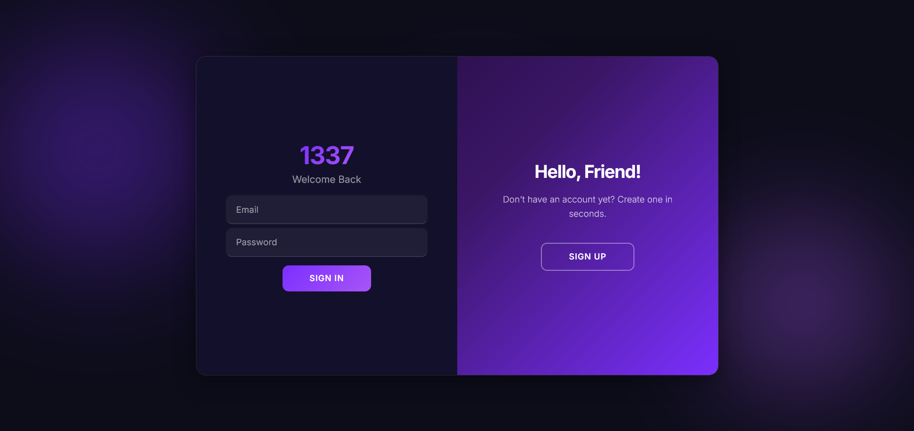
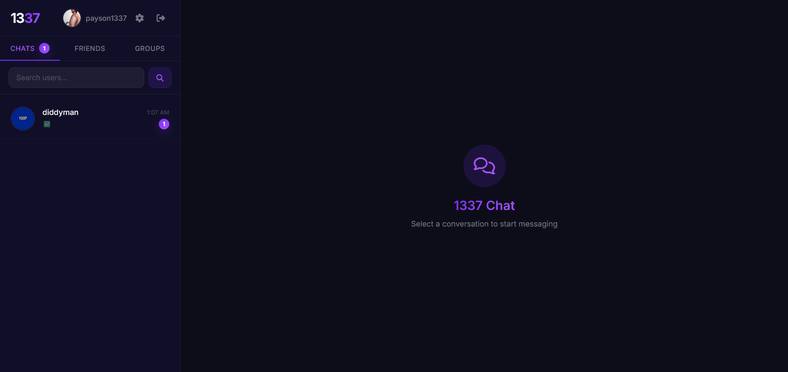
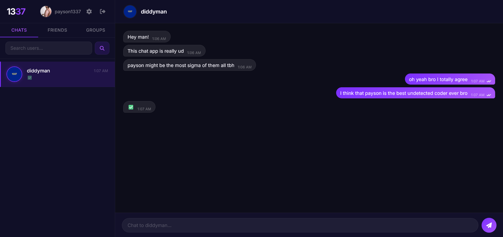

# 1337 Chat (Reborn)

This is a recoded and improved version of my previous project: [1337 chat app](https://gitlab.com/paysonism/1337-Chat).

Keep in mind that this is the official release repository so the BASE_URL will be set to my backend url.

# Preview

To test it out click [here](https://halmakebeep.github.io/1337-Chat-Reborn). Make an account and try searching for "payson1337" and messaging me!

**If nothing happens, go to https://one337-chat-reborn-server.onrender.com/ and wait for the server to show a success message, Then try again.**

Screenshot Previews:

# Installation

Follow the instructions below to setup this project!

1. Download and Install [Node.JS](https://nodejs.org/)
2. Click "Code -> Download .zip" to download the source code
3. Change BASE_URL in *dashboard.js (line 1)* and *login.js (line 13)* to be "http://localhost:1337"
4. Open a CMD window inside the "server" folder
5. Run the command ``npm install`` and wait for it to finish
6. To start the server, run the command ``npm run start`` in a cmd window inside of the "server" folder
7. Now, serve the frontend using the "Live Server" extension or a similar tool.

# Features

This is a list of the features in the latest build.

 **Please make a pull request if you implement any of these features before me!!!** 

- [X] Login
- [X] Register
- [X] Logout
- [X] Direct Messaging
- [X] Users Search
- [X] Group Chats
- [X] Friends System
- [X] Customizable Settings
- [ ] Voice Calling
- [ ] Video Calling
- [ ] End-To-End Encryption

# Credits

Made By [Payson](https://gitlab.com/paysonism) and [Jayesh](https://github.com/JayeshYadav07)
